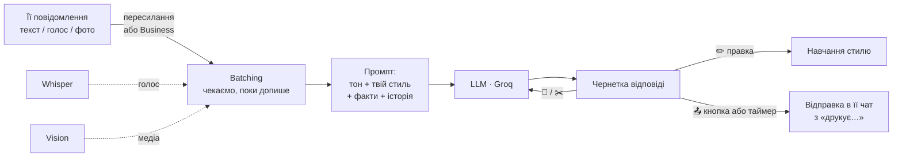

<div align="center">

# 💬 Telegram Chatting Bot

**Особистий AI-помічник для переписки в Telegram.**
Пересилаєш її повідомлення — отримуєш відповідь у потрібному тоні й у **твоєму** стилі письма.
А з Telegram Business бот сам бачить чат і може відповідати від твого імені.


-F55036)

</div>

---

## Зміст

- [Можливості](#-можливості)
- [Як це працює](#-як-це-працює)
- [Швидкий старт](#-швидкий-старт)
- [Змінні середовища](#-змінні-середовища)
- [Підключення через Telegram Business](#-підключення-через-telegram-business)
- [Команди й меню](#-команди-й-меню)
- [Тони](#-тони)
- [Структура проекту](#-структура-проекту)
- [Розробка](#-розробка)
- [Roadmap](#-roadmap)

---

## ✨ Можливості

| | Фіча | Що робить |
|---|---|---|
| 🎭 | **Тони** | 8 готових пресетів (флірт, дружній, романтичний, з гумором…) або власний опис тону |
| ✍️ | **Твій стиль письма** | Відповіді короткими повідомленнями, з маленької літери, твоїми словечками. Бот вчиться на твоїх правках відповідей |
| 🧠 | **Довга пам'ять** | LLM сама витягує факти про неї й про тебе з переписки та підкладає їх у промпт |
| 🎤 | **Голосові й кружечки** | Розпізнаються через Whisper і обробляються як звичайний текст |
| 🖼️ | **Фото, стікери, GIF, відео** | Vision-модель описує, що на них, і бот відповідає по суті |
| 📦 | **Пачки повідомлень** | Кілька коротких повідомлень підряд — одна думка. Бот чекає, поки вона допише, і відповідає на все разом |
| 🔗 | **Telegram Business** | Бот бачить її чат напряму, знає про редагування, видалення й цитати, відправляє відповідь кнопкою |
| ⏱️ | **Автовідправка** | Відповідь іде сама через 10 с, якщо не натиснув «Стоп», — з імітацією «друкує…» і паузами між повідомленнями |
| 💬 | **Питання для паузи** | Генерує теми, щоб розрядити незручне мовчання |
| 📊 | **Статистика** | Графік «хто скільки пише» + AI-оцінка її зацікавленості з позитивними/тривожними сигналами й порадою |
| 🔒 | **Приватність** | Доступ лише для Telegram ID з allowlist |
| 🆓 | **Безкоштовно** | Тільки free-tier LLM (Groq); провайдер змінюється через `.env` |

---

## 🧩 Як це працює



1. **Вхід.** Пересилаєш її повідомлення боту (або вони приходять самі через Telegram Business). Голосові розпізнаються, медіа описується vision-моделлю.
2. **Батчинг.** Бот дивиться, як закінчується останнє повідомлення: кома, «і», «короче» — чекає довше; «?» чи «)» — відповідає швидше. Максимум — 25 с.
3. **Генерація.** У промпт ідуть обраний тон, профіль твого стилю, твої минулі правки, факти про неї й про тебе, історія з часом повідомлень і цитатами.
4. **Чернетка.** Під відповіддю кнопки: надіслати, перегенерувати, коротше, редагувати.
5. **Відправка.** Від твого імені, з паузами «друкує…» пропорційно довжині кожного повідомлення.

---

## 🚀 Швидкий старт

### Вимоги

- **Node.js** 20+ і **pnpm**
- **Docker** (для локальної MongoDB)
- Токен бота від [@BotFather](https://t.me/BotFather)
- Безкоштовний ключ [Groq](https://console.groq.com/keys)

### Встановлення

```bash
git clone git@github.com:xxillavv/telegram-chatting-bot.git
cd telegram-chatting-bot

pnpm install
cp .env.example .env      # заповни TG_API_TOKEN і LLM_API_KEY

docker compose up -d      # MongoDB на 127.0.0.1:27017
pnpm start:dev
```

### Перший запуск

Бот за замовчуванням **закритий для всіх**. Напиши йому `/start` — він відповість твоїм Telegram ID. Додай його в `.env`:

```env
ALLOWED_USER_IDS=123456789
```

і перезапусти бота. Готово 🎉

---

## ⚙️ Змінні середовища

| Змінна | За замовчуванням | Опис |
|---|---|---|
| `TG_API_TOKEN` | — | Токен бота від BotFather |
| `LLM_API_KEY` | — | Ключ Groq (або іншого OpenAI-сумісного провайдера) |
| `LLM_BASE_URL` | `https://api.groq.com/openai/v1` | Endpoint OpenAI-сумісного API |
| `LLM_MODEL` | `openai/gpt-oss-120b` | Модель для відповідей |
| `STT_MODEL` | `whisper-large-v3` | Модель розпізнавання голосу |
| `STT_LANGUAGE` | `uk` | Мова голосових (ISO-639-1), порожньо — автовизначення |
| `VISION_MODEL` | `qwen/qwen3.8-27b` | Модель для опису фото й стікерів |
| `ALLOWED_USER_IDS` | — | Telegram ID через кому, яким дозволено користуватись ботом |
| `MONGO_URL` | `mongodb://127.0.0.1:27017` | Підключення до MongoDB |
| `MONGO_DB` | `telegram-chatting-bot` | Назва бази |
| `BOT_TIMEZONE` | `Europe/Kyiv` | Часовий пояс, у якому модель бачить час повідомлень |

> [!TIP]
> Провайдер легко змінити: будь-який OpenAI-сумісний API (OpenRouter `:free`-моделі, Gemini через OpenAI-endpoint тощо) підійде — достатньо поміняти `LLM_BASE_URL` і `LLM_MODEL`.

> [!NOTE]
> Безкоштовний Groq має ліміт ~8000 токенів на хвилину, тож бот тримає відповіді компактними.

---

## 🔗 Підключення через Telegram Business

Без Business бот працює в режимі «пересилай мені повідомлення». З Business — бачить її чат сам і відповідає від твого імені.

1. У [@BotFather](https://t.me/BotFather) → твій бот → **Bot Settings → Business Mode → Turn on**.
2. У Telegram: **Налаштування → Telegram Business → Чат-боти** → вкажи свого бота, дай доступ до потрібних чатів і дозвіл відповідати.
3. У боті натисни **🔗 Чат** (`/chat`) і вибери її чат або вкажи `@username`.
4. За бажання увімкни **автовідправку** — відповідь піде сама через 10 с, якщо не натиснеш «Стоп», і лише коли вона вже 15 с мовчить.

> [!WARNING]
> Telegram Business потребує Telegram Premium.

---

## 🕹️ Команди й меню

| Кнопка | Команда | Дія |
|---|---|---|
| 💬 Питання | `/questions` | Питання, щоб розрядити паузу |
| 📊 Статистика | `/stats` | Хто скільки пише і наскільки вона зацікавлена |
| 🎭 Тон | `/tone` | Обрати тон або описати власний |
| 🔗 Чат | `/chat` | Підключити її чат через Business |
| 👩 Про неї | `/about` | Ім'я, як познайомились, що їй подобається + збережені факти |
| 😀 Емодзі | — | Увімкнути/вимкнути емодзі у відповідях |
| ⚙️ Налаштування | `/settings` | Поточні налаштування, скидання стилю |
| 🧹 Нова переписка | `/reset` | Очистити історію (стиль і факти про тебе лишаються) |
| ❓ Допомога | `/help` | Як користуватись |

**Підказки:**
- Текст, який ти пишеш боту сам, вважається її повідомленням. Щоб додати свою репліку — почни з `я:` або перешли своє повідомлення.
- Можна пересилати кілька повідомлень одразу, голосові й кружечки теж.
- Кнопка **✏️ Редагувати** під відповіддю — найкращий спосіб навчити бота писати як ти.

---

## 🎭 Тони

| Тон | Характер |
|---|---|
| 😏 Флірт | Легкий, грайливий, з інтригою |
| 🔥 Пошлий | Сміливі двозначності, але збавляє оберти, якщо вона холодна |
| 🤬 Агро | Дерзко й з матом — на ситуації, не на неї |
| 🙂 Дружній | Тепло і невимушено, без підкатів |
| ❤️ Романтичний | Ніжно і щиро, без листівкових штампів |
| 😂 З гумором | Іронія, самоіронія, підхоплює її жарти |
| 😎 Впевнений | Коротко, спокійно, сам пропонує плани |
| 🤗 Турботливий | Підтримує, більше слухає, ніж говорить |

Тон задає **настрій**, а профіль стилю (`src/ai/prompts/my-style.prompt.ts`) — **форму**: довжину, регістр, словечки. Профіль діє завжди.

---

## 🗂️ Структура проекту

```
src/
├── ai/                     # усе, що стосується LLM
│   ├── ai.service.ts       # генерація відповідей, питань, аналізу, фактів
│   ├── llm.client.ts       # OpenAI-сумісний клієнт (Groq)
│   ├── speech.service.ts   # Whisper: голосові → текст
│   ├── vision.service.ts   # опис фото/стікерів/GIF/відео
│   └── prompts/            # базовий промпт, стиль, факти, аналіз інтересу
├── bot/
│   ├── bot.update.ts       # команди, кнопки, вхідні повідомлення
│   ├── business.handler.ts # Telegram Business: її чат, правки, видалення
│   ├── conversation.service.ts # чернетки, автовідправка, «друкує…»
│   ├── batching.ts         # скільки чекати, поки вона допише
│   ├── auto-send.ts        # таймінги автовідправки
│   └── access.ts           # allowlist за Telegram ID
├── session/                # сесії в MongoDB
├── stats/                  # графік (canvas) і текст статистики
├── tones/                  # пресети тонів
└── database/               # підключення до MongoDB
```

---

## 🛠️ Розробка

```bash
pnpm start:dev     # запуск з hot reload
pnpm build         # збірка в dist/
pnpm start:prod    # запуск зібраної версії
pnpm lint          # ESLint з автофіксом
pnpm format        # Prettier
pnpm test          # unit-тести
```

Сесії зберігаються в MongoDB і записуються при зупинці (`Ctrl+C`), тож історія й налаштування переживають перезапуск.

---

## 🗺️ Roadmap

- [x] Довга пам'ять — факти про неї й про тебе
- [x] Фото, стікери, GIF і відео через vision-модель
- [x] «Друкує…» і реалістичні паузи при автовідправці
- [ ] 2–3 варіанти відповіді на вибір (вибір = сигнал для стилю)
- [ ] Стоп-сигнали — вимикати автовідправку, коли розмова серйозна чи вона питає «це ти пишеш?»
- [ ] Нагадування — давно не відповів / розмова затихла
- [ ] Кілька чатів одночасно

---

<div align="center">

Зроблено з ☕ і NestJS · AI на безкоштовному [Groq](https://groq.com)

</div>
